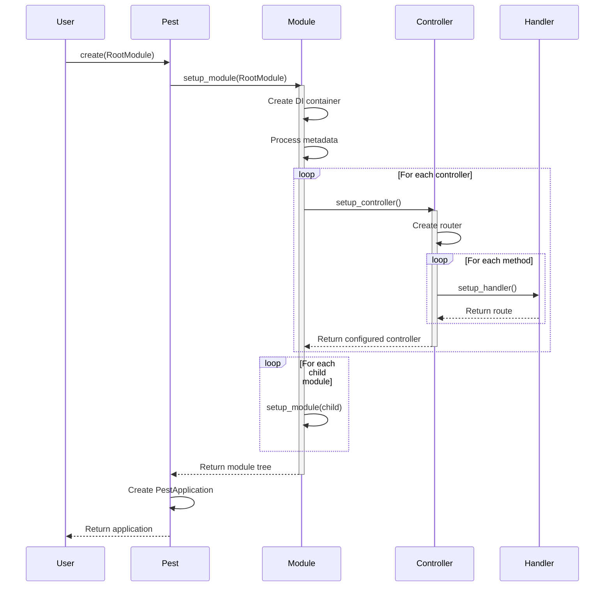
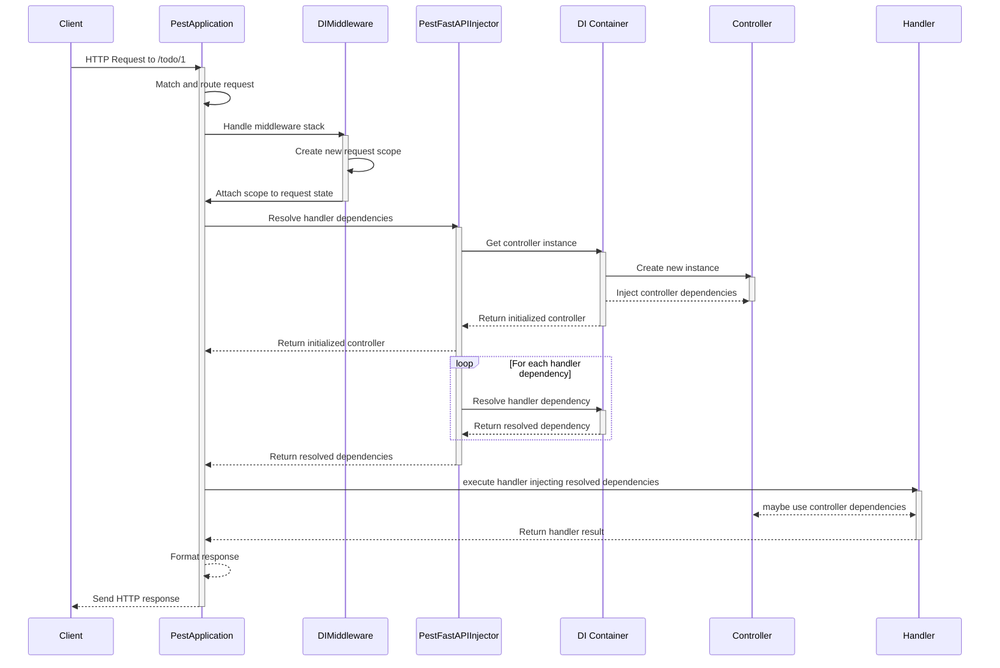

# Pest Framework Architecture

This document details how Pest Framework works internally.

## Application Creation Flow

The entry point for any Pest application is the `Pest.create(...)` method in 
[`factory/__init__.py`](./pest/factory/__init__.py):

```python
class Pest:
    @classmethod
    def create(
        cls,
        root_module: type,
        *,
        logging: Union[LoggingOptions, None] = None,
        middleware: MiddlewareDef = [],
        prefix: str = '',
        cors: Union[CorsOptions, None] = None,
        **fastapi_params: Unpack[FastAPIParams],
    ) -> PestApplication:
        pre_app.setup(logging=logging)
        app = make_app(fastapi_params, root_module, prefix=prefix, middleware=middleware)
        return post_app.setup(app, cors=cors)
```

This method orchestrates the entire application setup process. It first configures logging, then
creates the application through [`make_app(...)`](./pest/factory/app_creator.py), and finally
applies post-creation configurations like CORS settings.

The actual [`PestApplication`](./pest/core/application.py) (`FastAPI` subclass) creation happens in 
[`app_creator.py`](./pest/factory/app_creator.py):

```python
def make_app(
  fastapi_params: dict, root_module: type, middleware: list = [], prefix: str = ''
) -> PestApplication:
    # 1. Setup the module tree starting from root
    module_tree = setup_module(root_module)
    
    # 2. Create FastAPI application with the module tree
    app = PestApplication(module=module_tree, middleware=middleware, **fastapi_params)
    
    # 3. Get all routers from the module tree and register them
    for router in module_tree.routers:
        app.include_router(router, prefix=prefix)

    return app
```

This function builds the entire application structure. It first creates the module hierarchy through
[`setup_module()`](./pest/core/module.py), which recursively processes all modules and their
dependencies. Then it instantiates the [`PestApplication`](./pest/core/application.py) with the
module tree and registers all routers found in the modules.

## Decorator System & Metadata 

**Pest** uses decorators to configure classes and methods. 

There are three main decorators:

- [`@module`](./pest/decorators/module.py): Marks a class as a module
- [`@controller`](./pest/decorators/controller.py): Marks a class as a controller
- Handler decorators. Although there are many of these (one per HTTP method), they are all
  implemented in the same way:
    - [`@get`](./pest/decorators/handler.py), [`@post`](./pest/decorators/handler.py),
      [`@put`](./pest/decorators/handler.py), [`@delete`](./pest/decorators/handler.py),
      [`@patch`](./pest/decorators/handler.py), [`@options`](./pest/decorators/handler.py),
      [`@head`](./pest/decorators/handler.py), [`@trace`](./pest/decorators/handler.py)

These decorators provide two main functionalities:
- Store metadata for later use (metadata is stored in an internal `__pest__` attribute in the
  decorated class or function/method)
- Optionally, they can make the decorated class extend from a base class (subclasses of 
  [`PestPrimitive`](./pest/core/common/__init__.py))
    - `@module` makes the class extend [`Module`](./pest/core/module.py)
    - `@controller` makes the class extend [`Controller`](./pest/core/controller.py)

```python
META_KEY = '__pest__'  # Stored in meta.py

@module(controllers=[TodoController])
class TodoModule: pass
# Internally adds: TodoModule.__pest__ = {'controllers': [TodoController], ...}
# and makes TodoModule extend Module(PestPrimitive)

@controller('/todos')
class TodoController: pass 
# Internally adds: TodoController.__pest__ = {'prefix': '/todos', ...}
# and makes TodoController extend Controller(PestPrimitive)

@get('/items')
def get_items(): pass
# Internally adds: get_items.__pest__ = {'methods': ['GET'], 'path': '/items', ...}
```

## Primitives

At the core of Pest are its three fundamental primitives:
[`PestApplication`](./pest/core/application.py), [`Module`](./pest/core/module.py) and
[`Controller`](./pest/core/controller.py).

By applying the decorators `@module` and `@controller`, we make sure all modules and controllers
inherit from these primitives.

### [`PestApplication`](./pest/core/application.py) primitive

The first primitive is the [`PestApplication`](./pest/core/application.py) class. This class is a
subclass of FastAPI's `FastAPI` class and is responsible for managing the entire application. 

The main difference between [`PestApplication`](./pest/core/application.py) and `FastAPI` are:

- The [`PestApplication`](./pest/core/application.py) is aware of the dependency injection (DI)
  container of the root module.
- The [`PestApplication`](./pest/core/application.py) overrides `build_middleware_stack` to include
  a Pest-specific middleware: [`di_scope_middleware`](./pest/middleware/di.py).

The [`di_scope_middleware`](./pest/middleware/di.py) is responsible for creating a new DI scope for
each request and injecting it into the FastAPI request state. This is what allows the injection of
request-scoped dependencies into controllers, services and other middlewares.

A DI scope is, basically, a DI container that is created for each request and destroyed at the end
of it. This ensures that certain dependencies can have a request-level scope. That is, if a
dependency is resolved during the lifecycle of a request, that same instance of the dependency will
be reused in all places where it is injected in that request.

### [`Module`](./pest/core/module.py) primitive

The module primitive provides all modules with:
- [`__setup_module__`](./pest/core/module.py) method to initialize the module, all its controllers,
  and child modules.
  This method is called first for the root module and then recursively for all child, grandchild,
  etc. modules to initilaize the entire module tree.
- Self-contained DI container to manage dependencies and methods to register and resolve providers
  from its own DI container and from the providers exported by their child modules.

> **Note**: The modules are not responsible for creating 
> [`PestRouter`](./pest/utils/fastapi/router.py)s. This is done by the controllers (see below).

### [`Controller`](./pest/core/controller.py) primitive

The controller primitive provides all controller classes with a classmethod 
[`__setup_controller_class__`](pest/core/controller.py) to setup the controller and its handlers.

The [`__setup_controller_class__`](pest/core/controller.py) method is called by its parent module
during the module setup.
It will provide the controllers with their own [`PestRouter`](./pest/utils/fastapi/router.py) with
their respective routes.

It's important to note that the [`PestRouter`](./pest/utils/fastapi/router.py)s are instantiated at
a class level, meaning that they are shared across all instances of the controller class. We will
cover this in more detail in the "Request Flow and DI" section.

#### [Handler Methods]((./pest/core/handler.py))

During the controller setup, the controller class will process all its methods to find the ones
decorated with HTTP method decorators (e.g., `@get`, `@post`, etc.). These methods are then
converted to FastAPI `APIRoute`s and added to the controller's
[`PestRouter`](./pest/utils/fastapi/router.py).

The converting process is done by the [`setup_handler()`](./pest/core/handler.py) function, which is
called for each handler in the controller.

Again, we will cover this in more detail in the "Request Flow and DI" section.

## Module Tree Creation

When the application is created, it will recieve a root [`Module`](./pest/core/module.py) subclass.
This class is used as the entry point to build the entire module tree. This is the equivalent of an
`AppModule` in NestJS/Angular.

Modules are set up recursively through [`setup_module()`](./pest/core/module.py). Here's the
detailed flow:



The process works as follows:

1. **Module Creation**:
   - A module is instantiated when [`setup_module()`](./pest/core/module.py) is called
   - Its metadata is processed to extract controllers, imports, and providers
   - A DI container is created to manage dependencies
   - Child modules are recursively setup
   - Controllers are setup and registered in the module's DI container

2. **Controller Setup**:
   - Controllers are processed during module setup
   - Each controller creates its own [`PestRouter`](./pest/utils/fastapi/router.py) at a class level
   - Handler methods are discovered through metadata
   - Routes are created from handler metadata and added to the controller's router

3. **Handler Processing**:
   - Handler methods are decorated with HTTP method decorators (@get, @post, etc)
   - During controller setup, these handlers are converted to FastAPI `APIRoute`s
   - Dependencies are extracted from handler signatures
   - Routes are added to the controller's router

## Runtime

The handling of routes and requests in **pest** involves several key components working together:

1. **Route Integration**
When a Pest application is created through [`Pest.create()`](pest/factory/__init__.py), the
`make_app` function handles integrating all controller routes into the final
[`PestApplication`](./pest/core/application.py) application:

```python
module_tree = setup_module(root_module)
app = PestApplication(module=module_tree, middleware=middleware, **fastapi_params)

for router in routers:
    app.include_router(router, prefix=prefix)
```

2. **Handler Transformation** 
Handler methods from controllers are transformed into FastAPI `APIRoute`s through the following
process:

- The controller's [`__setup_controller_class__`](pest/core/controller.py) method processes each 
  handler method
- Each handler's metadata (from `@get`, `@post`, etc. decorators) is used to create route
  configurations
- The controller itself becomes a dependency of its handler methods, ensuring proper injection:

```python
@controller('/todo')
class TodoController:
    todos: TodoService  # Injected automatically
    
    @get('/')
    def get_all_todos(self) -> List[ReadTodoModel]:
        return self.todos.get_all()
```

The [`PestFastAPIInjector`](./pest/core/handler.py) plays a crucial role here by:
- Managing the dependency injection chain for each request
- Ensuring controllers are instantiated with their dependencies resolved
- Making controllers available to their handler methods as dependencies (injecting an instance of
  the controller as the `self` parameter)

This last point is crucial for Pest's architecture, as it allows the class-based system to work.

All this is done by the [`setup_handler`](./pest/core/handler.py) function:

```python
def setup_handler(cls, handler) -> APIRoute:
    ...
    handler_fn, handler_meta = handler
    _patch_handler_fn(cls, handler_fn) # <--- This is where the magic happens
    route = APIRoute(...)
    return route
```

The [`_patch_handler_fn`](./pest/core/handler.py) function is responsible for:

- Replaces the first parameter of the handler method with a FastAPI's 
  `Depends(PestFastAPIInjector(token=controller_cls, controller=controller_cls))`. This ensures that
  FastAPI will inject a controller instance into the handler `self` parameter when a request is
  received. A new instance of the controller is created for each request. If the controller itself
  has dependencies, they are resolved and injected as well by the `PestFastAPIInjector`.
- Replaces all arguments that are dependencies of the handler method; that is, those arguments
  marked with `= inject(something)` (or annotated with `inject`) in the method signature:
  - If the dependency is a function, we simple replace it with `Depends(the_function)`.
  - If the dependency is a class, we replace it with
    `Depends(PestFastAPIInjector(controller=ctrl, token=dependency_token))`. I this case, the 
    `PestFastAPIInjector`. By using the `controller` parameter, `PestFastAPIInjector` will be able
    to get the parent module of the controller and resolve the dependency from there.

In summary, all dependencies (including the controller itself) are resolved and injected into the
handler method by FastAPI's dependency injection system using `Depends()` on a `PestFastAPIInjector`
instance. Then the `PestFastAPIInjector` will resolve the dependencies using the module's internal
DI container.

### Request Flow and DI

When a request hits a **pest** application, here's what happens:

#### Request Reception
- The request first hits the [`PestApplication`](./pest/core/application.py) (a subclass of `FastAPI`)
- The application's middleware stack is processed, with
  [`di_scope_middleware`](./pest/middleware/di.py) running first:

```python
di_scope_mw = [
    Middleware(
        PestBaseHTTPMiddleware,
        dispatch=di_scope_middleware,
        parent_module=root_module(self),
    )
]
```
The [`di_scope_middleware`](./pest/middleware/di.py) creates a new DI scope for each request and
injects it into the FastAPI request state. This is what allows the injection of **pest**
request-scoped dependencies into controllers and services.

#### Dependency Resolution

Since all handlers were patched during setup, they are now ready to be called by FastAPI. When a
handler is called, FastAPI will call `PestFastAPIInjector` to resolve the handler's dependencies
that were markes to be injected by **pest**.

The `PestFastAPIInjector` then resolves the dependencies of the route handler by accessing the
parent module of the controller and resolving the dependencies from its DI container.

#### Controller Integration
A key aspect is how controllers work with their handlers:

- The controller class becomes a dependency of its handler methods
- When a handler is called, its controller is instantiated and injected into the handler as `self`.
  By resolving the controller, it also resolves all dependencies of the controller itself.
- The handler then has access to its fully-initialized controller instance

### Summary

