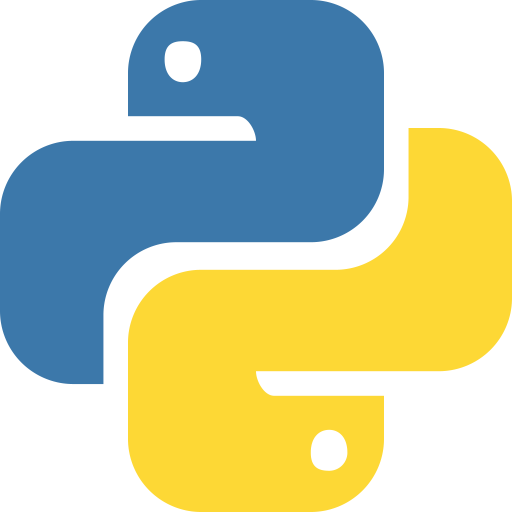
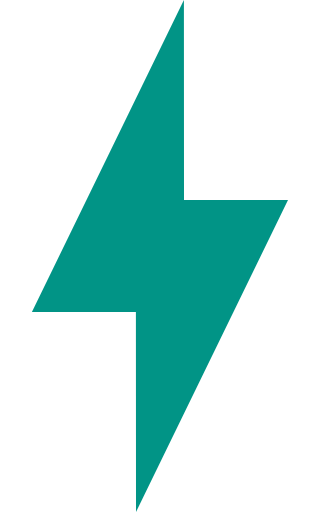

<p align="center">
  
</p>
<br/>

<p align="center">
 » python  web application framework designed for constructing scalable APIs, drawing inspiration from <a href="https://docs.nestjs.com/"> nest.js</a>  and based on <a href="https://fastapi.tiangolo.com/"> fastapi</a> .
</p>

<br/>

```math
\textcolor{orange}{\textbf{\large \texttt{pest}}} \large\simeq
  \begin{cases} 
    \quad \bigcup \; \lbrace \, \texttt{fastapi}, \; \texttt{rodi}, \; \texttt{mvc} \, \rbrace^{\; 🪄 ^{\; 🦄^{\; ✨}}} 
    \\ \\ 
    \quad \texttt{python} \; \bigcup \; \texttt{nestjs} 
  \end{cases}
```


